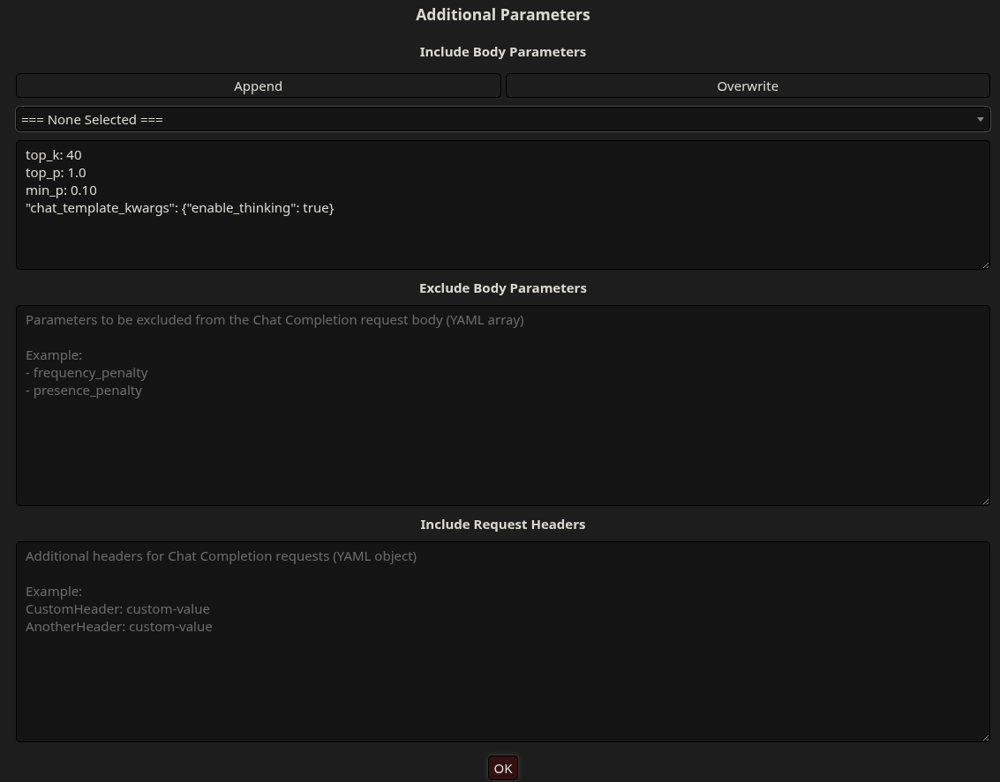
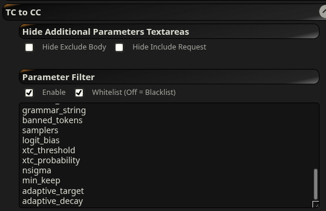
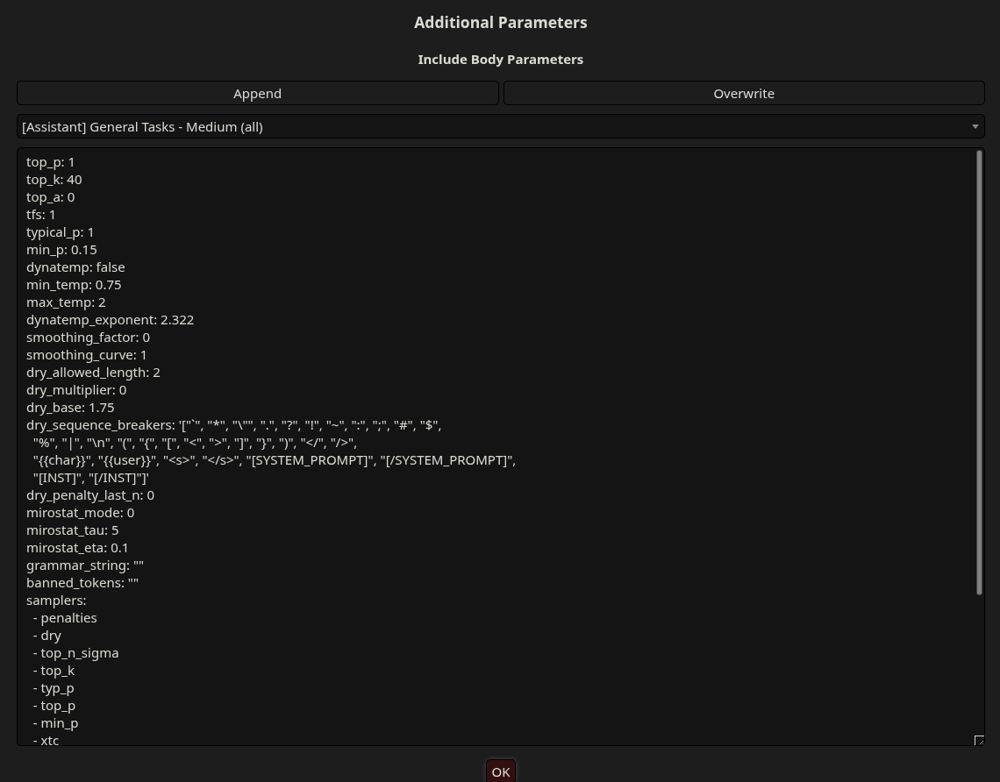

# SillyTavern-TC-to-CC

Convert your Text Completion presets into a YAML payload for Chat Completions!

## Features + Screen Shots

**New menu elements added to Additional Parameters menu.**

**A settings menu for de-cluttering Additional Parameters menu and for filtering which parameters to convert to CC.**

**Give yourself more space to work with by hiding the textareas you don't use.**

## Installation

1. Open the extension settings drawer (3 stacked blocks.)
2. Click 'Install extension'.
3. Paste in the following link: `https://github.com/CasualAutopsy/SillyTavern-TC-to-CC`
4. Click 'Install just for me'.
